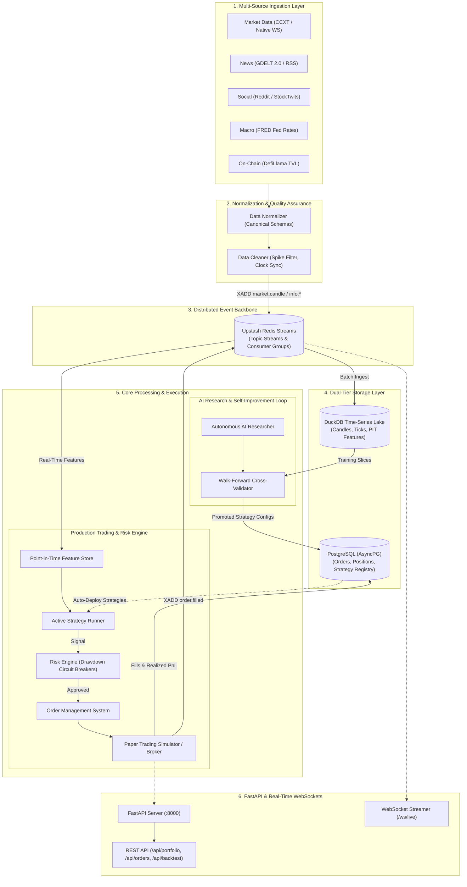

# Autonomous AI Trading Agent

A provider-agnostic, self-improving autonomous AI quantitative trading platform and research engine built with **DuckDB**, **PostgreSQL**, **Redis Streams**, and **FastAPI**, managed with **uv**.

---

## 🏛️ System Architecture



---

## ⚡ Quick Start with `uv`

### 1. Installation & Environment Sync
```bash
# Sync virtual environment & dependencies
uv sync
```

### 2. Run Tests
```bash
uv run pytest
```

### 3. Run Backend Server
```bash
# Run with uv
uv run uvicorn app.server:app --host 0.0.0.0 --port 8000 --reload
```

* **Interactive Swagger UI**: [http://localhost:8000/docs](http://localhost:8000/docs)
* **WebSocket Real-Time Feed**: `ws://localhost:8000/ws/live`
* **Health Check**: [http://localhost:8000/health](http://localhost:8000/health)

---

## 🧩 Architecture Summary

* **Provider-Agnostic Ingestion**: Hot-swappable providers for Market Data, News (GDELT), Social (Reddit), Macro (FRED), and On-Chain (DefiLlama).
* **Point-In-Time Feature Store**: Strict historical temporal alignment preventing lookahead bias.
* **Risk Engine & Circuit Breakers**: Position sizing, maximum drawdown circuit breakers, and bracket stops.
* **Autonomous AI Researcher**: Hypothesis generation, hyperparameter optimization, and out-of-sample walk-forward cross validation.
* **Dual Storage**: DuckDB for analytical time-series and PostgreSQL for transactional orders and experiment registries.
